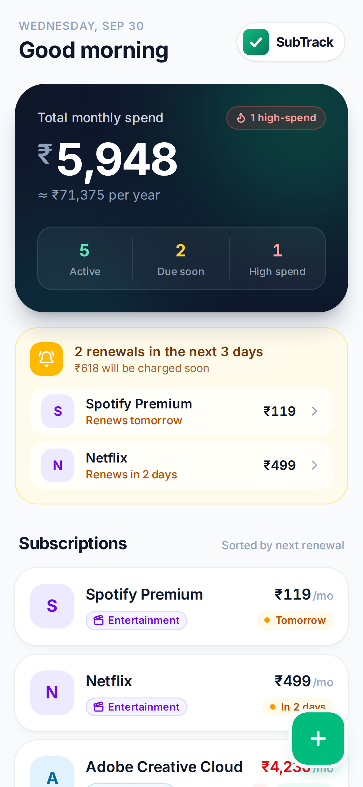

# SubTrack

A mobile-first web app for tracking recurring subscriptions, so you stop losing money to ones you forgot about or no longer use.

Built with React, Tailwind CSS v4 and lucide-react on Vite. It runs entirely in the browser. All amounts are in Indian Rupees (₹). Data is saved to `localStorage`, so there's no backend.



## Features

- **Dashboard**: total monthly spend (plus a yearly estimate), an alerts banner for renewals in the next 3 days (and any overdue ones), subscription cards sorted by next renewal, and a category spending breakdown.
- **Add / edit**: name, cost, billing cycle (weekly / monthly / yearly, converted to a monthly figure), next renewal date and category.
- **Detail view**: edit, delete (asks for confirmation) or mark as cancelled. A cancelled subscription moves to the collapsible *Inactive* list and can be reactivated.
- **Colour system**: green means healthy, amber means renewing soon, red means overdue or high spend (₹2,000/mo or more).
- Comes with 5 example subscriptions on first launch. Their renewal dates are set relative to today, so the alerts banner always has something to show.

## Run it

```bash
cd subtrack
npm install
npm run dev      # http://localhost:5173
```

`npm run build` makes a production build in `dist/`.

To reset to the example data, clear the `subtrack:v2` key in localStorage.
